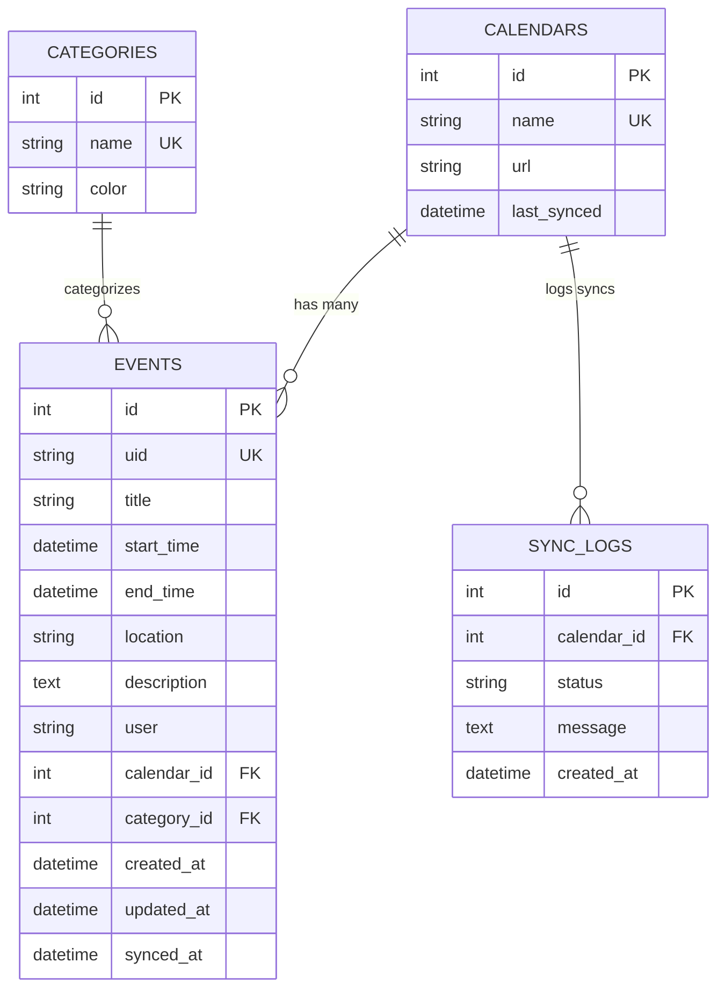

# HomeBase Database Schema

## Overview

HomeBase uses SQLite as its database with SQLAlchemy ORM. The schema is designed to support calendar synchronization, event management, and category organization.

## Database Tables

### 1. `calendars` Table

**Purpose**: Stores external calendar configurations and metadata.

```sql
CREATE TABLE calendars (
    id INTEGER PRIMARY KEY,
    name VARCHAR(255) NOT NULL UNIQUE,
    url VARCHAR(500) NOT NULL,
    last_synced DATETIME
);
```

**Fields**:
- `id`: Primary key, auto-incrementing integer
- `name`: Calendar name (e.g., "iCloud Calendar", "Hockey Schedule")
- `url`: Calendar URL (CalDAV URL for iCloud, webcal URL for public calendars)
- `last_synced`: Timestamp of last successful sync operation

**Usage**:
- One record per external calendar
- Used for sync operations and event attribution
- Supports multiple calendar sources

### 2. `categories` Table

**Purpose**: Event categorization with color coding for visual organization.

```sql
CREATE TABLE categories (
    id INTEGER PRIMARY KEY,
    name VARCHAR UNIQUE NOT NULL,
    color VARCHAR NOT NULL
);
```

**Fields**:
- `id`: Primary key, auto-incrementing integer
- `name`: Category name (e.g., "Work", "Personal", "Hockey")
- `color`: Hex color code for visual representation

**Predefined Categories**:
- Hockey (automatically created by hockey sync)
- Work, Personal, Family (common categories)

**Color Palette**:
- `#FF6B6B` (Coral Red)
- `#4ECDC4` (Turquoise)
- `#45B7D1` (Sky Blue)
- `#96CEB4` (Mint Green)
- `#FFEAA7` (Soft Yellow)
- `#DDA0DD` (Plum)
- `#98D8C8` (Seafoam)
- `#F7DC6F` (Golden Yellow)

### 3. `events` Table

**Purpose**: Main event storage with relationships to calendars and categories.

```sql
CREATE TABLE events (
    id INTEGER PRIMARY KEY,
    uid VARCHAR UNIQUE NOT NULL,
    title VARCHAR,
    start_time DATETIME,
    end_time DATETIME,
    location VARCHAR,
    description TEXT,
    user VARCHAR,
    calendar_id INTEGER NOT NULL,
    category_id INTEGER,
    created_at DATETIME DEFAULT CURRENT_TIMESTAMP,
    updated_at DATETIME DEFAULT CURRENT_TIMESTAMP,
    synced_at DATETIME,
    FOREIGN KEY (calendar_id) REFERENCES calendars(id),
    FOREIGN KEY (category_id) REFERENCES categories(id)
);
```

**Fields**:
- `id`: Primary key, auto-incrementing integer
- `uid`: Unique identifier (UUID) for sync operations
- `title`: Event title/name
- `start_time`: Event start datetime (timezone-aware)
- `end_time`: Event end datetime (timezone-aware)
- `location`: Event location (optional)
- `description`: Event description (optional)
- `user`: Associated user (optional, for future multi-user support)
- `calendar_id`: Foreign key to calendars table
- `category_id`: Foreign key to categories table (optional)
- `created_at`: Record creation timestamp
- `updated_at`: Last update timestamp (auto-updated)
- `synced_at`: Last sync timestamp (for sync operations)

**Indexes**:
- `uid` (unique): For sync operations
- `start_time`: For date-based queries
- `calendar_id`: For calendar-specific queries
- `category_id`: For category filtering

### 4. `sync_logs` Table

**Purpose**: Tracks sync operations, errors, and performance metrics.

```sql
CREATE TABLE sync_logs (
    id INTEGER PRIMARY KEY,
    calendar_id INTEGER NOT NULL,
    status VARCHAR NOT NULL,
    message TEXT,
    created_at DATETIME DEFAULT CURRENT_TIMESTAMP,
    FOREIGN KEY (calendar_id) REFERENCES calendars(id)
);
```

**Fields**:
- `id`: Primary key, auto-incrementing integer
- `calendar_id`: Foreign key to calendars table
- `status`: Sync status ("success", "error", "partial")
- `message`: Detailed message or error description
- `created_at`: Log entry timestamp

**Usage**:
- Debug sync issues
- Monitor sync performance
- Track calendar-specific problems

## Relationships

### Entity Relationship Diagram



### Relationship Details

1. **Calendar → Events** (One-to-Many)
   - One calendar can have many events
   - Events must belong to a calendar
   - Cascade delete: Deleting a calendar deletes all its events

2. **Calendar → Sync Logs** (One-to-Many)
   - One calendar can have many sync log entries
   - Used for tracking sync history and errors

3. **Category → Events** (One-to-Many)
   - One category can be assigned to many events
   - Events can optionally have a category
   - Prevents deletion of categories with associated events

## Data Flow

### Event Creation Flow

1. **Local Event Creation**:
   ```
   User Input → Event Schema → Database → UID Generation → Sync Queue
   ```

2. **Sync Event Creation**:
   ```
   External Calendar → CalDAV Client → Event Schema → Database → UID Assignment
   ```

### Sync Operations

1. **Downward Sync** (iCloud → Local):
   ```
   iCloud Calendar → CalDAV → Event Objects → Database Upsert → Sync Log
   ```

2. **Upward Sync** (Local → iCloud):
   ```
   Database Events → CalDAV → iCloud Calendar → Sync Status → Sync Log
   ```

3. **Hockey Sync** (Website → Local):
   ```
   Website Scraping → Event Objects → Hockey Category → Database → Sync Log
   ```

## Query Patterns

### Common Queries

1. **Get Events by Date Range**:
   ```sql
   SELECT * FROM events 
   WHERE start_time >= ? AND start_time <= ?
   ORDER BY start_time;
   ```

2. **Get Events by Category**:
   ```sql
   SELECT e.*, c.name as category_name, c.color as category_color
   FROM events e
   LEFT JOIN categories c ON e.category_id = c.id
   WHERE e.category_id = ?;
   ```

3. **Get Calendar Events**:
   ```sql
   SELECT e.*, c.name as calendar_name
   FROM events e
   JOIN calendars c ON e.calendar_id = c.id
   WHERE e.calendar_id = ?;
   ```

4. **Get Recent Sync Logs**:
   ```sql
   SELECT * FROM sync_logs
   WHERE calendar_id = ?
   ORDER BY created_at DESC
   LIMIT 10;
   ```

### Performance Considerations

1. **Indexes**: All foreign keys and frequently queried fields are indexed
2. **Time-based Queries**: `start_time` index for date range queries
3. **Sync Operations**: `uid` unique index for efficient sync lookups
4. **Category Filtering**: `category_id` index for category-based queries

## Migration Strategy

### Adding New Fields

1. **Update Model**: Modify SQLAlchemy model in `app/models/`
2. **Update Schema**: Modify Pydantic schema in `app/schemas.py`
3. **Recreate Database**: Run `python3 scripts/create_db.py`
4. **Seed Data**: Run `python3 scripts/seed_categories.py`

### Schema Changes

When making schema changes:

1. **Backup**: Always backup `database.db` before changes
2. **Test**: Test changes in development environment
3. **Deploy**: Use deployment script for production updates
4. **Verify**: Check data integrity after migration

## Data Integrity

### Constraints

1. **Foreign Key Constraints**: Enforced at database level
2. **Unique Constraints**: `uid` and `calendar.name` must be unique
3. **NOT NULL Constraints**: Required fields enforced
4. **Cascade Deletes**: Calendar deletion cascades to events and sync logs

### Validation

1. **Schema Validation**: Pydantic models validate data structure
2. **Business Logic**: Service layer enforces business rules
3. **Sync Validation**: UID uniqueness ensures sync integrity
4. **Category Protection**: Prevents deletion of categories with events

## Backup and Recovery

### Backup Strategy

1. **Database File**: Copy `database.db` to backup location
2. **Configuration**: Backup `config.py` and environment files
3. **Logs**: Archive sync logs for historical analysis

### Recovery Process

1. **Stop Application**: Stop the running application
2. **Restore Database**: Copy backup `database.db` to project directory
3. **Verify Integrity**: Check data consistency
4. **Restart Application**: Start the application

## Monitoring and Maintenance

### Health Checks

1. **Database Connectivity**: Verify database connection
2. **Table Integrity**: Check foreign key relationships
3. **Sync Status**: Monitor recent sync log entries
4. **Performance**: Monitor query performance

### Maintenance Tasks

1. **Clean Old Logs**: Archive old sync log entries
2. **Optimize Database**: Run SQLite optimization commands
3. **Update Statistics**: Update SQLite table statistics
4. **Verify Backups**: Test backup and recovery procedures 