# HomeBase Calendar

A comprehensive home management application built with FastAPI and modern web technologies. HomeBase helps you organize and manage your home-related tasks, events, and information in one centralized location with seamless calendar synchronization.

## 🚀 Current Status

**Version**: 1.1.0  
**Status**: Production Ready  
**Last Updated**: December 2024

### ✅ Implemented Features

- **📅 Calendar Management**: Full CalDAV integration with iCloud
- **🔄 Canonical iCloud Sync**: iCloud as the single source of truth
- **🏒 Specialized Sync**: Hockey schedule sync from Wallingford Hawks website
- **🏷️ Category Management**: Color-coded event categorization with neon colors
- **📱 Responsive UI**: Daily, weekly, and monthly calendar views
- **⚡ Real-time Updates**: Live synchronization across the application
- **🔧 Settings Management**: Calendar configuration and sync controls
- **📊 Event Management**: Create, edit, delete, and categorize events
- **🖥️ Multi-view Interface**: Daily timeline, weekly grid, and monthly overview

### 🔄 Sync Capabilities

- **Canonical iCloud Model**: iCloud is the source of truth for all events
- **Create/Update/Delete**: All operations push to iCloud first, then sync local DB
- **Hockey Sync**: Specialized sync for Wallingford Hawks hockey schedule
- **Automatic Cleanup**: Remove old hockey events automatically
- **Conflict Resolution**: Smart handling of duplicate events

## 🏗️ Architecture

### Canonical iCloud Sync Model

HomeBase now uses **iCloud as the canonical source of truth** for all calendar events. This ensures:

- **No Data Divergence**: iCloud and HomeBase are always in sync
- **iOS Integration**: Changes appear immediately on all iOS devices
- **Reliable Sync**: Eliminates duplicate events and sync conflicts
- **Simple Conflict Resolution**: "Last write wins" based on iCloud

#### How It Works

1. **Event Creation**: 
   - Event is created in iCloud first via CalDAV
   - Local DB is synced from iCloud to get the final event data
   - Returns the event as stored in iCloud

2. **Event Updates**:
   - Event is updated in iCloud first (delete + recreate)
   - Local DB is synced from iCloud
   - Returns the updated event from iCloud

3. **Event Deletion**:
   - Event is deleted from iCloud first
   - Local DB is synced from iCloud
   - Ensures complete removal from both systems

4. **Manual Sync**:
   - Pulls all events from iCloud
   - Overwrites local DB with iCloud data
   - Ensures local DB matches iCloud exactly

#### Benefits

- ✅ **No Duplicates**: iCloud prevents duplicate events
- ✅ **iOS Compatibility**: Changes appear on iPhone/iPad immediately  
- ✅ **Reliable Sync**: Single source of truth eliminates conflicts
- ✅ **Simple Architecture**: Clear data flow and error handling

### Tech Stack

- **Backend**: FastAPI (Python 3.9+)
- **Database**: SQLite with SQLAlchemy ORM
- **Frontend**: HTML5, CSS3, Vanilla JavaScript
- **Calendar Integration**: CalDAV with iCloud support
- **Scheduling**: APScheduler for background tasks
- **Deployment**: Systemd service for Raspberry Pi

### Project Structure

```
HomeBase/
├── app/                    # Main application code
│   ├── api/               # API endpoints
│   │   ├── calendar.py    # Calendar management
│   │   ├── categories.py  # Category management
│   │   └── events.py      # Event management
│   ├── models/            # Database models
│   │   ├── calendar.py    # Calendar model
│   │   ├── events.py      # Event and Category models
│   │   └── sync_logs.py   # Sync logging
│   ├── services/          # Business logic
│   │   ├── calendar_sync.py      # Downward sync
│   │   └── calendar_sync_up.py   # Upward sync
│   ├── utils/             # Utility functions
│   │   └── database.py    # Database configuration
│   ├── config/            # Configuration
│   │   └── categories.py  # Category colors
│   ├── schemas.py         # Pydantic schemas
│   └── main.py           # FastAPI application
├── frontend/              # Frontend assets
│   ├── static/           # CSS, JS, and assets
│   │   ├── css/          # Stylesheets
│   │   └── js/           # JavaScript modules
│   └── templates/        # HTML templates
├── scripts/               # Utility scripts
│   ├── create_db.py      # Database initialization
│   ├── seed_categories.py # Category seeding
│   ├── hockey_schedule_sync.py # Hockey sync
│   └── ...               # Other utility scripts
├── tests/                 # Test scripts
│   ├── test_caldav_connection.py
│   ├── test_category_management.py
│   └── ...               # Other test scripts
├── tools/                 # Deployment and development tools
│   ├── deploy.sh         # Deployment script
│   ├── dev.sh            # Development script
│   └── deploy-config.env # Deployment configuration
├── data/                  # Data files
│   └── calendar.ics      # Sample calendar data
├── venv/                 # Python virtual environment
├── config.py            # Application settings
├── requirements.txt     # Python dependencies
└── DEPLOYMENT.md       # Deployment guide
```

## 🗄️ Database Schema

### Core Tables

#### `calendars` Table
```sql
CREATE TABLE calendars (
    id INTEGER PRIMARY KEY,
    name VARCHAR(255) NOT NULL UNIQUE,
    url VARCHAR(500) NOT NULL,
    last_synced DATETIME
);
```
**Purpose**: Stores external calendar configurations (iCloud, etc.)

#### `categories` Table
```sql
CREATE TABLE categories (
    id INTEGER PRIMARY KEY,
    name VARCHAR UNIQUE NOT NULL,
    color VARCHAR NOT NULL
);
```
**Purpose**: Event categorization with color coding

#### `events` Table
```sql
CREATE TABLE events (
    id INTEGER PRIMARY KEY,
    uid VARCHAR UNIQUE NOT NULL,
    title VARCHAR,
    start_time DATETIME,
    end_time DATETIME,
    location VARCHAR,
    description TEXT,
    user VARCHAR,
    calendar_id INTEGER NOT NULL,
    category_id INTEGER,
    created_at DATETIME DEFAULT CURRENT_TIMESTAMP,
    updated_at DATETIME DEFAULT CURRENT_TIMESTAMP,
    synced_at DATETIME,
    FOREIGN KEY (calendar_id) REFERENCES calendars(id),
    FOREIGN KEY (category_id) REFERENCES categories(id)
);
```
**Purpose**: Main event storage with relationships to calendars and categories

#### `sync_logs` Table
```sql
CREATE TABLE sync_logs (
    id INTEGER PRIMARY KEY,
    calendar_id INTEGER NOT NULL,
    status VARCHAR NOT NULL,
    message TEXT,
    created_at DATETIME DEFAULT CURRENT_TIMESTAMP,
    FOREIGN KEY (calendar_id) REFERENCES calendars(id)
);
```
**Purpose**: Tracks sync operations and errors

### Relationships

```mermaid
erDiagram
    CALENDARS ||--o{ EVENTS : "has many"
    CALENDARS ||--o{ SYNC_LOGS : "logs syncs"
    CATEGORIES ||--o{ EVENTS : "categorizes"
    
    CALENDARS {
        int id PK
        string name UK
        string url
        datetime last_synced
    }
    
    EVENTS {
        int id PK
        string uid UK
        string title
        datetime start_time
        datetime end_time
        string location
        text description
        string user
        int calendar_id FK
        int category_id FK
        datetime created_at
        datetime updated_at
        datetime synced_at
    }
    
    CATEGORIES {
        int id PK
        string name UK
        string color
    }
    
    SYNC_LOGS {
        int id PK
        int calendar_id FK
        string status
        text message
        datetime created_at
    }
```



## 🚀 Quick Start

### Prerequisites

- Python 3.9 or higher
- pip (Python package manager)
- iCloud account with calendar access

### Local Development Setup

1. **Clone and setup**
   ```bash
   git clone <repository-url>
   cd HomeBase
   python3 -m venv venv
   source venv/bin/activate  # On Windows: venv\Scripts\activate
   pip install -r requirements.txt
   ```

2. **Configure iCloud sync**
   ```bash
   # Edit config.py with your iCloud credentials
   icloud_username = "your-apple-id@icloud.com"
   icloud_password = "your-app-specific-password"
   icloud_calendar_url = "your-calendar-webcal-url"
   ```

3. **Initialize database**
   ```bash
   python3 scripts/create_db.py
   python3 scripts/seed_categories.py
   ```

4. **Run the application**
   ```bash
   python3 -m uvicorn app.main:app --reload --host 0.0.0.0 --port 8000
   ```

5. **Access the application**
   - Web Interface: `http://localhost:8000`
   - API Docs: `http://localhost:8000/docs`

### Raspberry Pi Deployment

For production deployment on Raspberry Pi:

```bash
# Configure your Pi's IP address
export PI_HOST=pi@192.168.1.50  # Replace with your Pi's IP

# Deploy
./tools/deploy.sh
```

See [DEPLOYMENT.md](DEPLOYMENT.md) for detailed deployment instructions.

## 📡 API Endpoints

### Events (Canonical iCloud Sync)
- `GET /api/events/` - Get all events from local DB
- `POST /api/events/` - Create new event (pushes to iCloud first, then syncs local DB)
- `PATCH /api/events/{id}` - Update event (updates iCloud first, then syncs local DB)
- `DELETE /api/events/{id}` - Delete event (deletes from iCloud first, then syncs local DB)

**Note**: All event operations require iCloud connectivity. If iCloud is unavailable, operations will fail with appropriate error messages.

### Categories
- `GET /api/categories/` - Get all categories
- `POST /api/categories/` - Create category
- `PUT /api/categories/{id}` - Update category
- `DELETE /api/categories/{id}` - Delete category
- `GET /api/categories/colors` - Get available colors

### Calendar Sync
- `GET /api/calendar/` - Get all calendars
- `POST /api/calendar/` - Create calendar
- `POST /api/calendar/sync` - Sync from iCloud (legacy - use manual sync)
- `POST /api/calendar/sync-up` - Sync to iCloud (legacy - use manual sync)
- `POST /api/calendar/sync-two-way` - Full two-way sync (recommended)
- `POST /api/calendar/sync-import` - Import from iCloud only
- `POST /api/calendar/sync-export` - Export to iCloud only
- `POST /api/calendar/sync-hockey` - Sync hockey schedule

## 🎨 Frontend Features

### Calendar Views
- **Daily View**: Timeline-based view with hour slots
- **Weekly View**: 7-day grid layout
- **Monthly View**: Traditional calendar grid

### Event Management
- Click to view event details
- Edit events inline
- Delete events with confirmation
- Category assignment with color coding

### Sync Controls
- Manual sync buttons
- Real-time sync status
- Error reporting and logging

## 🔧 Configuration

### Environment Variables

Create a `.env` file or set environment variables:

```bash
# iCloud Configuration
ICLOUD_USERNAME=your-apple-id@icloud.com
ICLOUD_PASSWORD=your-app-specific-password
ICLOUD_CALENDAR_URL=your-calendar-webcal-url

# Database
DATABASE_URL=sqlite+aiosqlite:///./database.db

# Server
HOST=0.0.0.0
PORT=8000

# Sync Settings
SYNC_INTERVAL_MINUTES=15
MAX_SYNC_RETRIES=3
```

### Category Colors

Predefined neon colors for categories:
- `#FF6B6B` (Coral Red)
- `#4ECDC4` (Turquoise)
- `#45B7D1` (Sky Blue)
- `#96CEB4` (Mint Green)
- `#FFEAA7` (Soft Yellow)
- `#DDA0DD` (Plum)
- `#98D8C8` (Seafoam)
- `#F7DC6F` (Golden Yellow)

## 🔄 Sync Operations

### Canonical iCloud Sync Model

All sync operations now treat iCloud as the source of truth:

#### Event Operations
- **Create**: Event created in iCloud → Local DB synced from iCloud
- **Update**: Event updated in iCloud → Local DB synced from iCloud  
- **Delete**: Event deleted from iCloud → Local DB synced from iCloud

#### Manual Sync Operations
- **Full Sync**: Pull all events from iCloud, overwrite local DB
- **Import Only**: Pull new/updated events from iCloud to local DB
- **Export Only**: Push local events to iCloud (for initial setup)

### Hockey Schedule Sync
- Scrapes Wallingford Hawks website
- Creates hockey-specific category
- Syncs game schedules
- Cleans up old events automatically

### Error Handling

The system handles various error scenarios:

- **iCloud Unavailable**: Operations fail gracefully with clear error messages
- **Authentication Issues**: Credential errors are reported immediately
- **Network Problems**: Timeout and connection errors are handled
- **Partial Failures**: Individual event failures don't stop the entire sync

## 🛠️ Development

### Adding New Features

1. **API Endpoints**: Add to `app/api/`
2. **Database Models**: Add to `app/models/`
3. **Business Logic**: Add to `app/services/`
4. **Frontend**: Update templates and JavaScript

### Database Migrations

When modifying models:
```bash
# Update model definitions in app/models/
# Run database recreation
python3 scripts/create_db.py
```

### Testing

```bash
# Test specific functionality
python3 tests/test_caldav_connection.py
python3 tests/test_category_management.py
python3 tests/test_hockey_sync.py
```

## 🐛 Troubleshooting

### Common Issues

1. **iCloud Sync Fails**
   - Verify app-specific password
   - Check calendar URL format
   - Ensure 2FA is enabled on Apple ID
   - Test iCloud connectivity: `python3 tests/test_caldav_connection.py`

2. **Event Operations Fail**
   - Check iCloud connectivity first
   - Verify HomeBase calendar exists on iCloud
   - Ensure proper CalDAV credentials
   - Check for network connectivity issues

3. **Database Errors**
   - Delete `database.db` and recreate
   - Run `python3 scripts/create_db.py`
   - Sync from iCloud to restore data

4. **Port Conflicts**
   - Change port in `config.py`
   - Check for other services using port 8000

5. **Canonical Sync Issues**
   - Run manual sync: `POST /api/calendar/sync-two-way`
   - Check iCloud calendar for duplicates
   - Use cleanup scripts: `python3 scripts/cleanup_ios_duplicates_advanced.py`

### Testing the Canonical Sync

```bash
# Test iCloud connectivity
python3 tests/test_caldav_connection.py

# Test canonical sync operations
python3 tests/test_canonical_icloud_sync.py

# Test two-way sync
python3 tests/test_two_way_sync.py
```

### Logs

- **Application Logs**: Check console output
- **Sync Logs**: Query `sync_logs` table
- **System Logs**: `sudo journalctl -u homebase -f`
- **iCloud Errors**: Check for CalDAV authentication and network errors

## 📈 Roadmap

### Phase 2 Features
- [ ] Weather integration
- [ ] User authentication
- [ ] Multiple calendar support
- [ ] Event reminders
- [ ] Mobile app
- [ ] Backup/restore functionality

### Phase 3 Features
- [ ] Task management
- [ ] Shopping lists
- [ ] Home inventory
- [ ] Maintenance schedules
- [ ] Family member management

## 🤝 Contributing

1. Fork the repository
2. Create a feature branch: `git checkout -b feature-name`
3. Make your changes and commit: `git commit -m 'Add feature'`
4. Push to branch: `git push origin feature-name`
5. Submit a pull request

## 📄 License

This project is licensed under the MIT License - see the LICENSE file for details.

## 🆘 Support

- **Issues**: Open an issue in the repository
- **Documentation**: Check [DEPLOYMENT.md](DEPLOYMENT.md) for deployment help
- **API Docs**: Available at `/docs` when running the application

---

**HomeBase Calendar** - Making home management simple and organized. 🏠📅 